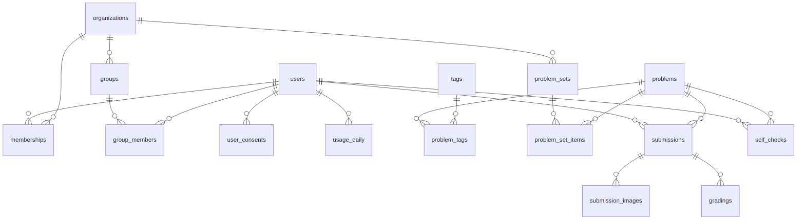

# データベース設計（Cloudflare D1）

AI添削を核にした演習アプリのデータベース設計を行う。

## 設計原則

1. **問題コンテンツはD1が原本で管理画面で編集する**：
   問題・解答・解説・採点基準は、承認済みユーザーがアプリの管理画面から作成・編集する。CC BY-SAの公開データセットや一括投入が必要になったら、`slug` をキーにしたエクスポート・インポートで橋渡しする（将来）。
2. **ユーザーデータはD1のみに置く**：
   逆に、ユーザー・答案・添削結果はD1が原本でリポジトリには入れない。
3. **答案画像はR2、D1にはキーのみ**：
   画像は非公開R2バケットに置き、署名付きURLでのみ配信する。保持期間（既定90日）を過ぎた画像はライフサイクルルールで自動削除し、添削結果（テキスト）だけを学習履歴として残す。
4. **添削は非同期**：
   アップロード → `submissions` 作成 → Queueへ投入 → コンシューマがClaude APIを呼ぶ → `gradings` 作成、という流れ。リトライは `attempt_count` で管理する。
5. **マルチテナントは初日から**：
   塾・学校向けの後付けを避けるため、`organizations` / `memberships` / `groups` は最初から用意する。個人利用者はどの組織にも属さない。
6. **添削結果は追記型**：
   `gradings` は上書きせず追記する。`submission_id` ごとに `created_at` が最新の行を有効な添削とみなす。

## 規約

- 主キーは全テーブル共通 `TEXT` でアプリ側で生成する**UUIDv7**を使用する
- URLや同期キーに使う人間可読な識別子は主キーにせず、`slug` カラムとして別に持つ
- 時刻は `INTEGER`
- 利用量集計の日付だけは `TEXT` で `YYYY-MM-DD`
- JSONを格納するカラムは `*_json`
- 外部キーはD1では既定で有効
- 削除の伝播は各テーブルの `ON DELETE` に従う

## 全体像



## テーブル定義

### アカウント系

認証は better-auth を想定する。`session` / `account` / `verification` テーブルはbetter-authが生成・管理するため省略し、ここでは `users`（better-authのuserテーブルに `additionalFields` で拡張カラムを追加したもの）の論理設計のみ示す。

```sql
-- ユーザー
-- 実名は取得しない（display_nameはニックネーム）
CREATE TABLE users (
  id              TEXT PRIMARY KEY,
  email           TEXT NOT NULL UNIQUE,
  email_verified  INTEGER NOT NULL DEFAULT 0,
  display_name    TEXT NOT NULL,
  role            TEXT NOT NULL DEFAULT 'student'
                    CHECK (role IN ('student', 'teacher', 'admin')),
  -- 評価データセットへの答案提供に同意しているか
  -- 既定はオフで規約への同意とは別に取得する
  research_opt_in INTEGER NOT NULL DEFAULT 0,
  created_at      INTEGER NOT NULL,
  updated_at      INTEGER NOT NULL
);

-- 組織（塾・学校）
CREATE TABLE organizations (
  id          TEXT PRIMARY KEY,
  name        TEXT NOT NULL,
  kind        TEXT NOT NULL DEFAULT 'juku'
                CHECK (kind IN ('juku', 'school', 'community', 'other')),
  plan        TEXT NOT NULL DEFAULT 'free',
  -- NULLならプラン既定値を使う
  grading_quota_monthly INTEGER,
  created_at  INTEGER NOT NULL,
  updated_at  INTEGER NOT NULL
);

-- 所属（ユーザーと組織の多対多）
CREATE TABLE memberships (
  id         TEXT PRIMARY KEY,
  org_id     TEXT NOT NULL REFERENCES organizations(id) ON DELETE CASCADE,
  user_id    TEXT NOT NULL REFERENCES users(id) ON DELETE CASCADE,
  role       TEXT NOT NULL DEFAULT 'student'
               CHECK (role IN ('student', 'teacher', 'org_admin')),
  created_at INTEGER NOT NULL,
  UNIQUE (org_id, user_id)
);

-- クラス・講座
-- フェーズ2で利用する器だけ先行して用意
CREATE TABLE groups (
  id         TEXT PRIMARY KEY,
  org_id     TEXT NOT NULL REFERENCES organizations(id) ON DELETE CASCADE,
  name       TEXT NOT NULL,
  created_at INTEGER NOT NULL
);

CREATE TABLE group_members (
  group_id TEXT NOT NULL REFERENCES groups(id) ON DELETE CASCADE,
  user_id  TEXT NOT NULL REFERENCES users(id) ON DELETE CASCADE,
  PRIMARY KEY (group_id, user_id)
);

-- 同意の記録（利用規約・プライバシーポリシー・保護者同意・評価データ提供）
-- 規約改定のたびにversionを上げて再同意を取る
CREATE TABLE user_consents (
  id         TEXT PRIMARY KEY,
  user_id    TEXT NOT NULL REFERENCES users(id) ON DELETE CASCADE,
  kind       TEXT NOT NULL
               CHECK (kind IN ('tos', 'privacy', 'parental', 'research')),
  version    TEXT NOT NULL,
  granted_at INTEGER NOT NULL,
  revoked_at INTEGER,
  UNIQUE (user_id, kind, version)
);
```

### コンテンツ系

```sql
-- 問題バンク（管理画面から編集する）
CREATE TABLE problems (
  id              TEXT PRIMARY KEY,
  -- URLと外部参照に使う人間可読な識別子
  slug            TEXT NOT NULL UNIQUE,
  title           TEXT NOT NULL,
  -- 10段階（1が教科書例題レベル）
  difficulty      INTEGER NOT NULL CHECK (difficulty BETWEEN 1 AND 10),
  -- KaTeXで描画できる形で格納する
  statement_tex   TEXT NOT NULL,
  answer_tex      TEXT,
  explanation_tex TEXT,
  -- 採点基準（AI添削プロンプトに注入する）
  -- 生徒には見せない
  grading_notes   TEXT,
  -- 自作・典型問題はCC BY-SAで他者著作物の引用はquoted
  -- CC問題のみ公開データセットのエクスポート対象にする
  license         TEXT NOT NULL DEFAULT 'CC-BY-SA-4.0'
                    CHECK (license IN ('CC-BY-SA-4.0', 'quoted')),
  source          TEXT NOT NULL,
  -- 引用問題の出典表示（license = 'quoted' のとき必須）
  attribution     TEXT,
  status          TEXT NOT NULL DEFAULT 'draft'
                    CHECK (status IN ('draft', 'published', 'archived')),
  -- 将来のエクスポート・一括投入の差分検出用
  content_hash    TEXT,
  created_at      INTEGER NOT NULL,
  updated_at      INTEGER NOT NULL
);

-- タグ（単元タグ + その下の項目タグ）
-- kind = 'unit' の行が単元別演習のナビゲーションになる
-- kind = 'topic' の行は parent_id で単元にぶら下がる
-- 例 数I > 数と式（unit） > 因数分解（topic）
CREATE TABLE tags (
  id         TEXT PRIMARY KEY,
  slug       TEXT NOT NULL UNIQUE,
  name       TEXT NOT NULL UNIQUE,
  kind       TEXT NOT NULL DEFAULT 'unit' CHECK (kind IN ('unit', 'topic')),
  -- 親タグ（topicのとき所属する単元）
  parent_id  TEXT REFERENCES tags(id) ON DELETE SET NULL,
  -- kind = 'unit' のとき '数I' '数A' など
  subject    TEXT,
  sort_order INTEGER
);

CREATE TABLE problem_tags (
  problem_id TEXT NOT NULL REFERENCES problems(id) ON DELETE CASCADE,
  tag_id     TEXT NOT NULL REFERENCES tags(id) ON DELETE CASCADE,
  PRIMARY KEY (problem_id, tag_id)
);

-- 問題セット（公式の単元別演習も塾の自作課題もこれで表現する）
CREATE TABLE problem_sets (
  id          TEXT PRIMARY KEY,
  title       TEXT NOT NULL,
  description TEXT,
  -- NULLなら公式セット（全体公開）
  org_id      TEXT REFERENCES organizations(id) ON DELETE CASCADE,
  created_by  TEXT REFERENCES users(id) ON DELETE SET NULL,
  created_at  INTEGER NOT NULL
);

CREATE TABLE problem_set_items (
  set_id     TEXT NOT NULL REFERENCES problem_sets(id) ON DELETE CASCADE,
  problem_id TEXT NOT NULL REFERENCES problems(id) ON DELETE CASCADE,
  sort_order INTEGER NOT NULL,
  PRIMARY KEY (set_id, problem_id)
);
```

数IAの単元タグのシード（`kind = 'unit'`）：

| slug | name | subject |
| :-- | :-- | :-- |
| shiki | 数と式 | 数I |
| nijikansu | 二次関数 | 数I |
| zukei-keiryo | 図形と計量 | 数I |
| data-bunseki | データの分析 | 数I |
| baainokazu-kakuritsu | 場合の数と確率 | 数A |
| zukei-seishitsu | 図形の性質 | 数A |
| seisu | 整数の性質 | 数A |

項目タグ（`kind = 'topic'`）は各単元の下に必要に応じて追加する。例：`shiki` の下に `insu-bunkai`（因数分解）。問題は原則として項目タグに紐付け、単元ページでは項目ごとにグルーピングして表示する。項目が未整備の問題は単元タグに直接紐付けてよい。

### 添削系

```sql
-- 答案の提出
CREATE TABLE submissions (
  id            TEXT PRIMARY KEY,
  user_id       TEXT NOT NULL REFERENCES users(id) ON DELETE CASCADE,
  problem_id    TEXT NOT NULL REFERENCES problems(id),
  -- 提出時にどの組織の文脈だったか（個人利用はNULL）
  -- 組織の利用量集計とレポートに使う
  org_id        TEXT REFERENCES organizations(id) ON DELETE SET NULL,
  status        TEXT NOT NULL DEFAULT 'uploaded'
                  CHECK (status IN ('uploaded', 'queued', 'grading', 'graded', 'failed')),
  -- 依頼時に生徒が添えるメッセージ（添削の観点の希望など）
  -- AI添削プロンプトに注入する
  student_message TEXT,
  -- 添削ジョブの試行回数（Queueのリトライ管理）
  attempt_count INTEGER NOT NULL DEFAULT 0,
  last_error    TEXT,
  -- R2画像を削除した時刻（保持期間経過後にクリーンアップジョブが記録）
  images_deleted_at INTEGER,
  created_at    INTEGER NOT NULL,
  graded_at     INTEGER
);

-- 答案画像（複数ページ対応）
CREATE TABLE submission_images (
  id            TEXT PRIMARY KEY,
  submission_id TEXT NOT NULL REFERENCES submissions(id) ON DELETE CASCADE,
  r2_key        TEXT NOT NULL,
  page_no       INTEGER NOT NULL DEFAULT 1,
  content_type  TEXT NOT NULL,
  size_bytes    INTEGER,
  created_at    INTEGER NOT NULL
);

-- 添削結果（追記型）
-- 同一submission内でcreated_atが最新の行を有効な添削とみなす
CREATE TABLE gradings (
  id             TEXT PRIMARY KEY,
  submission_id  TEXT NOT NULL REFERENCES submissions(id) ON DELETE CASCADE,
  grader_type    TEXT NOT NULL CHECK (grader_type IN ('ai', 'human')),
  -- grader_type = 'human' のとき添削した先生
  grader_user_id TEXT REFERENCES users(id) ON DELETE SET NULL,
  -- 品質計測（評価セットの回帰テスト）と突合するためモデルとプロンプトの版を残す
  model          TEXT,
  prompt_version TEXT,
  verdict        TEXT NOT NULL
                   CHECK (verdict IN ('correct', 'partially_correct', 'incorrect',
                                      'cannot_judge', 'unreadable')),
  -- 0.0-1.0
  -- 低い添削は先生のレビューキューに出す（フェーズ2）
  confidence     REAL,
  feedback_json  TEXT NOT NULL,
  created_at     INTEGER NOT NULL
);

-- 自己採点ログ（添削を使わない演習の学習履歴）
CREATE TABLE self_checks (
  id         TEXT PRIMARY KEY,
  user_id    TEXT NOT NULL REFERENCES users(id) ON DELETE CASCADE,
  problem_id TEXT NOT NULL REFERENCES problems(id),
  result     TEXT NOT NULL CHECK (result IN ('correct', 'partial', 'wrong')),
  created_at INTEGER NOT NULL
);

-- 日次利用量（無料枠の制御）
-- 添削ジョブ投入と同一バッチでUPSERTし上限を超えたら投入を拒否する
CREATE TABLE usage_daily (
  user_id  TEXT NOT NULL REFERENCES users(id) ON DELETE CASCADE,
  day      TEXT NOT NULL,
  gradings INTEGER NOT NULL DEFAULT 0,
  PRIMARY KEY (user_id, day)
);
```

### インデックス

```sql
-- 生徒の学習履歴表示
CREATE INDEX idx_submissions_user ON submissions(user_id, created_at DESC);
-- 組織のレポート集計
CREATE INDEX idx_submissions_org ON submissions(org_id, created_at DESC);
-- 滞留ジョブの監視
CREATE INDEX idx_submissions_pending ON submissions(status)
  WHERE status IN ('queued', 'grading');
CREATE INDEX idx_submission_images_sub ON submission_images(submission_id);
CREATE INDEX idx_gradings_submission ON gradings(submission_id, created_at DESC);
CREATE INDEX idx_problem_tags_tag ON problem_tags(tag_id);
CREATE INDEX idx_memberships_user ON memberships(user_id);
CREATE INDEX idx_self_checks_user ON self_checks(user_id, created_at DESC);
CREATE INDEX idx_problems_status ON problems(status);
```

## feedback_json のフォーマット

Claude APIには添削結果をこの構造で出力させる。`errors[].type` は評価セットの誤り分類と同じ語彙を使う。

```json
{
  "transcription": "読み取った答案の書き起こし（KaTeX互換TeX）",
  "steps": [
    { "page": 1, "summary": "解答ステップの要約", "ok": true, "comment": "正しい変形" }
  ],
  "errors": [
    {
      "location": "該当箇所の引用",
      "type": "calculation | logic | misconception | notation | incomplete",
      "explanation": "何がどう誤っているか",
      "hint": "答えを直接言わない誘導"
    }
  ],
  "overall_comment": "全体講評",
  "next_recommendation": "次に取り組むべき単元や問題の提案"
}
```

## 評価用データベース（別D1）

品質計測（コミュニティ提供の答案サンプル + 人手の模範添削）は本番と分離した専用のD1データベースに置く。本番の `users.research_opt_in = 1` のユーザーの答案は、匿名化（氏名等のクロップ）のうえ評価用R2バケットへコピーできる。評価用バケットはライフサイクル削除の対象外。

```sql
CREATE TABLE eval_samples (
  id           TEXT PRIMARY KEY,
  -- 本番の問題をslugで参照（DBをまたぐためFKは張らない）
  problem_slug TEXT NOT NULL,
  -- 匿名化済み答案画像（評価用バケット）
  r2_key       TEXT NOT NULL,
  -- community: コミュニティからの直接提供 / production: research同意済み本番答案
  provenance   TEXT NOT NULL CHECK (provenance IN ('community', 'production')),
  -- 人手の模範添削（verdict + feedback_jsonと同形式）
  gold_json    TEXT,
  notes        TEXT,
  created_at   INTEGER NOT NULL
);

CREATE TABLE eval_runs (
  id             TEXT PRIMARY KEY,
  model          TEXT NOT NULL,
  prompt_version TEXT NOT NULL,
  started_at     INTEGER NOT NULL,
  notes          TEXT
);

CREATE TABLE eval_results (
  run_id        TEXT NOT NULL REFERENCES eval_runs(id) ON DELETE CASCADE,
  sample_id     TEXT NOT NULL REFERENCES eval_samples(id) ON DELETE CASCADE,
  output_json   TEXT NOT NULL,
  -- 正誤判定がgoldと一致したか
  verdict_match INTEGER,
  -- 誤り指摘の再現率と適合率（goldのerrorsとの突合）
  error_recall    REAL,
  error_precision REAL,
  -- 指摘の的確さの人間評価 1-5
  human_rating  INTEGER,
  PRIMARY KEY (run_id, sample_id)
);
```

## 個人情報とデータライフサイクル

| データ | 置き場所 | 保持期間 |
| :-- | :-- | :-- |
| 答案画像 | 非公開R2バケット | 90日で自動削除（ライフサイクルルール） |
| 添削結果（テキスト） | D1 `gradings` | 学習履歴として無期限 |
| 評価用サンプル画像 | 評価用R2バケット | 無期限（明示同意があるもののみ） |
| アカウント削除時 | — | `ON DELETE CASCADE` で答案・履歴を一括削除、R2画像はクリーンアップジョブで削除 |

- 添削でClaude APIに画像を送信するため、プライバシーポリシーに外部委託・越境移転を明記する（Anthropic APIは既定でAPIデータを学習に使わない）
- `research_opt_in` は登録時オフ。評価データ提供は `user_consents` の `kind = 'research'` とセットで記録する

## 将来の拡張（フェーズ2以降、DDLは実装時に）

- **assignments**: 課題配信。`problem_sets` を `groups` に期限付きで割り当てる（org_id, group_id, problem_set_id, due_at）
- **invites**: 組織への招待コード（org_id, code, role, expires_at）
- **review_queue**: `confidence` が低いAI添削を先生が確認・上書きするキュー。`gradings` の追記型設計がそのまま器になる
- **videos**: 解説動画（Cloudflare StreamのUID、problem_id / tag_idへの紐付け）
- **講師投稿・審査**: videosに status（submitted / approved / rejected）と審査ログを追加

## マイグレーション運用

- Drizzle ORMのスキーマ定義（`schema.ts`）を原本とし、`drizzle-kit generate` でSQLマイグレーションを生成、`wrangler d1 migrations apply` で適用する
- 本ドキュメントは設計意図の記録。カラムの追加・変更時はここも更新する
